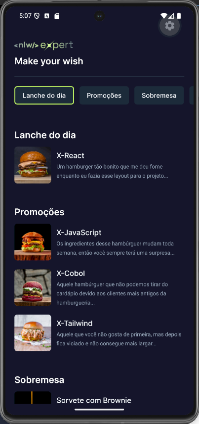

<p align="center" >
  
</p>

<p align="center">
  
  
  
  
  
  
  
</p>

<p align="center">
  <a href="#-technologies">Technologies</a>&nbsp;&nbsp;&nbsp;|&nbsp;&nbsp;&nbsp;
  <a href="#-project">Project</a>&nbsp;&nbsp;&nbsp;|&nbsp;&nbsp;&nbsp;
  <a href="#-layout">Layout</a>&nbsp;&nbsp;&nbsp;|&nbsp;&nbsp;&nbsp;
  <a href="#-license">License</a>
</p>

<p align="center">
  
</p>

<br>

<p align="center">
  
</p>

## 🚀 Technologies

This project was developed with the following technologies:

- **Framework**: React Native and Expo
- **Language**: TypeScript
- **Styling**: NativeWind
- **Global State Management**: Zustand
- **File Based Routing**: Expo Router

## 🚧 Project

Transform the way customers interact with local menus. This React Native application bridges the gap between digital browsing and instant communication. Users can explore a curated product catalog, build their perfect order, and dispatch it, along with all necessary customer details, straight to the vendor’s WhatsApp in a single tap.

## 🧰 Prerequisites

- Node.js (version 18 or later)
- `npm` or `yarn`
- A physical device or an emulator is required to run this application

## 💻 How to run

```bash
# Clone the repository
git clone https://github.com/filipebteixeira98/expert-delivery-app.git

# Access the project folder
cd expert-delivery-app

# Install the dependencies
npm install

# Start the Metro Bundler
npm start
```

## 🫶 Contributing

Contributions are welcome! Please feel free to submit a Pull Request.

## 📝 License

This project is under the MIT license.

<p align="center">
  Made with ♥ by me
</p>
